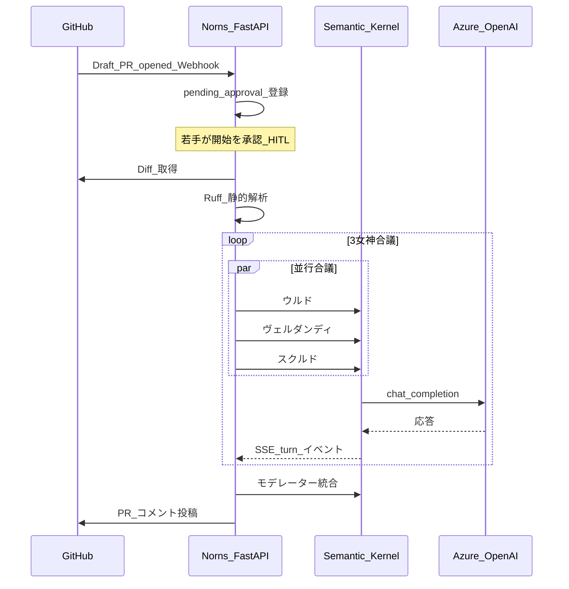
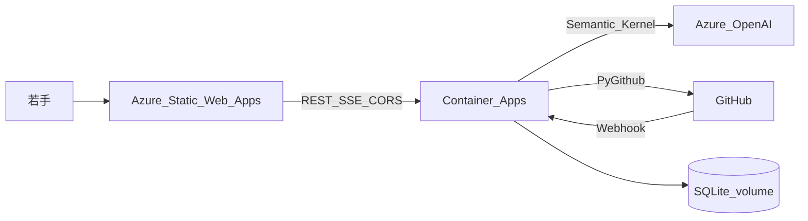

## はじめに

こんにちは。本記事は [Microsoft Agent Hackathon 2026](https://zenn.dev/hackathons/microsoft-agent-hackathon-2026) への提出作品 **Norns（ノルンズ）** の技術解説です。

| 項目 | URL |
|------|-----|
| **デモ（UI）** | https://gentle-mushroom-0e3c9b500.7.azurestaticapps.net/ |
| **API / Webhook** | https://norn.agreeablesky-b0ed548a.japaneast.azurecontainerapps.io |
| **GitHub** | https://github.com/narita1980/norn-agents |
| **デモ動画** | （YouTube URL を提出フォーム・概要欄に記載） |

### デモの試し方（審査員向け）

1. 上記 **デモ UI** を開く
2. ログイン: ID **`yuki`** / パスワード **`norn-demo`**
3. チャット下部 **「手動 PR 登録」** に `owner/repo#番号` または PR URL を入力（Webhook なしでも可）
4. 表示された **`[開始する]`** を押す → 右パネル **合議ライブ** で 3 女神の SSE 合議を確認
5. ナビ右上で **ゆき / たけし / さくら** を切替可能（レベル別トーン比較）

---

## 解決したい課題

若手エンジニアの多くが **「PR を出すのが怖い」** 経験を持っています。

- シニアの時間が足りず、フィードバックが遅い・厳しすぎる
- 単一 LLM レビューは「厳しすぎる」か「甘すぎる」かの二極化
- 既存ボットは GitHub 上にコメントを置くだけで、**成長の伴走** にならない

Norns は **心理的安全性** を保ちながら、**技術・共感・成長** の 3 視点を合議で統合し、若手が自分のペースでレビューを開始できる（Human-in-the-loop）システムです。

### ビジネスインパクト（推定）

| 指標 | 根拠 |
|------|------|
| 1 PR あたりシニア工数 **約 30 分削減** | 初回レビューの定形部分（スタイル・軽微指摘）を Norns が担う |
| 1 レビューあたり若手学習時間 **約 12 分相当** | must_fix / next_pr / growth の構造化出力で自学習がしやすい |
| 心理的安全性 | ヴェルダンディ（共感）視点がトーンを調整 |

※ ダッシュボード KPI は完了レビュー数 × 係数の推定値です。本番導入時は計測基盤で検証します。

---

## Norns とは

**Norns** は GitHub **Draft PR** をトリガーに、3 つの AI ペルソナが合議してコードレビューとメンタリングを行う Web アプリです。

| ペルソナ | 役割 | ユーザー向け名 |
|----------|------|----------------|
| Urd | 技術的正確性・must_fix | ウルド（メンター） |
| Verdandi | 共感・心理的安全性 | ヴェルダンディ（伴走） |
| Skuld | 成長・next_pr | スクルド（キャリア） |
| Moderator | 合議の統合 | モデレーター（合議） |

名前は北欧神話の運命を司る **Norns（ノルンズ）** に由来します。

---

## なぜマルチエージェントか

単一 LLM に「優しくレビューして」と頼むと、技術指摘が薄くなりがちです。逆に「厳しく」すると若手が萎えます。

Norns は **並行合議**（ウルド・ヴェルダンディ・スクルドが同時に視点を生成 → モデレーターが統合）で、各視点を独立に生成してから 1 本のレビューにまとめます。デモでは合議待ち時間（30〜90 秒）を短縮するため逐次ではなく並行を採用しています。Microsoft Semantic Kernel の **Azure OpenAI コネクタ** 経由で各エージェントを呼び出しています。

GroupChat 的な自由討論は採用していません。ハッカソン向け AI エージェント設計の教訓どおり、**1 ラウンド固定 + 構造化 JSON 出力** で無限ループを防いでいます。

---

## Agentic パイプライン

審査テーマの「自律的に動くエージェント」を、Norns では **end-to-end パイプライン自律** として実装しています。



**HITL（Human-in-the-loop）** は「開始タイミングだけ人間」です。それ以降の Diff 取得・解析・合議・GitHub 投稿は自動です。Copilot 等の即時自動レビューと異なり、**若手が「準備できた」と判断するまで待つ** ことで心理的安全性を担保します。

---

## Azure アーキテクチャ



| コンポーネント | 技術 |
|----------------|------|
| フロント | Azure Static Web Apps（React + Vite） |
| API / Webhook / SSE | Azure Container Apps（FastAPI） |
| LLM | Azure OpenAI（gpt-4.1-mini 等） |
| オーケストレーション | カスタム `NornOrchestrator` + Semantic Kernel コネクタ |
| リアルタイム | SSE（in-memory EventBus、workers=1） |
| 永続化 | SQLite（`/data` ボリューム） |

デプロイ手順は [docs/hackathon/AZURE_DEPLOY.md](https://github.com/narita1980/norn-agents/blob/main/docs/hackathon/AZURE_DEPLOY.md) を参照してください。

---

## 主要機能

### 1. Human-in-the-loop

Draft PR opened 時点では合議を **開始しません**。チャット UI に `[開始する]` / `[スキップ]` が表示され、若手が選べます。

### 2. 合議のライブ可視化

`GET /chat/threads/{id}/events`（SSE）で右パネル `ConsensusPanel` に各女神の発言が順次表示されます。デモ動画の中心シーンです。

### 3. GitHub 双方向連携

- 合議結果を PR コメントとして投稿
- PR 上のリプライで **再合議**（会話履歴を引き継ぎ）

### 4. 成長ダッシュボード

完了レビュー数・トーン分布・推定 KPI を `GET /dashboard/stats` で表示。

### 5. レベル別パーソナライズ（デモ）

テストユーザー（ゆき / たけし / さくら）を **ナビ右上の切替** またはログイン画面から選べます。同じ PR でも `user_level` ごとに別セッションとなり、メンタリングの深さが変わります。

> **Webhook 連携時の注意**: Draft PR opened は **`junior`（ゆき）向けセッションのみ** 自動登録されます。たけし・さくらで試す場合は **手動 PR 登録** を使ってください。

---

## 技術スタック

- **Backend**: Python 3.11, FastAPI, uv, SQLAlchemy async, Alembic
- **Frontend**: React 19, TypeScript, Vite, bun
- **AI**: Semantic Kernel + Azure OpenAI
- **GitHub**: PyGithub, Webhook HMAC 検証

---

## ローカル開発

```bash
cd backend && uv sync && cp .env.example .env
cd ../frontend && bun install

# Terminal A
cd backend && uv run uvicorn norn.api.main:app --reload --port 8000 --workers 1

# Terminal B
cd frontend && bun dev
```

---

## 限界と今後

| 項目 | 現状 | 今後 |
|------|------|------|
| EventBus | in-memory（workers=1 必須） | Redis Pub/Sub |
| DB | SQLite | PostgreSQL 本番 |
| Skuld RAG | 未実装 | Azure AI Search |
| 認証 | テストユーザー切替 | GitHub OAuth |
| テスト | pytest 再作成予定 | CI 整備 |

---

## おわりに

Norns は「AI がレビューを代行する」のではなく、**若手が安心して PR を出し、学びながら直せる** 体験を Agentic AI で実現します。3 女神の合議を「見える化」することで、ブラックボックス感を減らし、メンタリングツールとしての信頼を高めています。

[デモ URL](https://gentle-mushroom-0e3c9b500.7.azurestaticapps.net/) から実際の合議フローをご覧ください。フィードバック歓迎です。

---

## 参考リンク

- [Microsoft Agent Hackathon 2026](https://zenn.dev/hackathons/microsoft-agent-hackathon-2026)
- [Norns GitHub リポジトリ](https://github.com/narita1980/norn-agents)
- [Semantic Kernel](https://learn.microsoft.com/semantic-kernel/)
- [Azure OpenAI Service](https://learn.microsoft.com/azure/ai-services/openai/)
