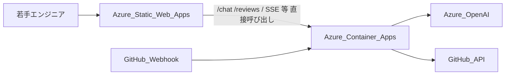
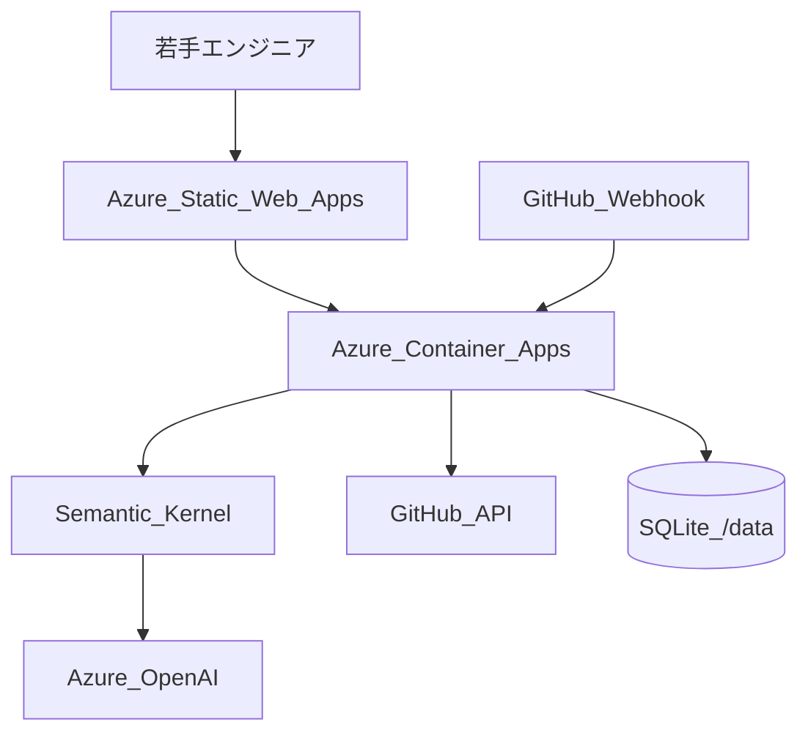

# Azure デプロイ手順 — Microsoft Agent Hackathon 2026 提出用

Norn は **フロントエンド: Azure Static Web Apps** + **バックエンド: Azure Container Apps** の分割構成を推奨します。UI は SWA で配信し、API / Webhook / SSE は Container Apps が担当します（`VITE_API_BASE_URL` ビルド注入 + バックエンド CORS + Basic 認証）。

## アーキテクチャ



| コンポーネント | Azure サービス | ワークフロー job |
|---|---|---|
| フロント（React UI） | Static Web Apps | `Deploy to Azure` → **Frontend** |
| API / Webhook / SSE | Container Apps | `Deploy to Azure` → **Backend** |

---

## Step 1: フロントエンド（Static Web Apps）— まずここから

### 1-1. Static Web Apps リソース作成

Azure Portal で Static Web Apps を作成します（プラン: **Free**、デプロイ認可: **デプロイ トークン**）。

| フィールド | 値 |
|---|---|
| アプリの場所 | `frontend` |
| API の場所 | 空欄 |
| 出力先 | `dist` |

作成後、**デプロイ トークン** を GitHub → Settings → Secrets → Actions に登録:

| Secret | 値 |
|---|---|
| `AZURE_STATIC_WEB_APPS_API_TOKEN` | Portal のデプロイ トークン |

### 1-2. デプロイ実行

- **自動**: `main` に `frontend/` の変更を push
- **手動**: Actions → **Deploy to Azure** → Run workflow（Frontend / Backend を個別に ON/OFF 可能）

完了後 `https://<name>.azurestaticapps.net` で UI が表示されます（API 未接続のためチャットはエラー — 正常）。

### 1-3. バックエンド接続後（Step 2 完了後）

GitHub Secrets を追加して frontend ワークフローを再実行:

| Secret | 用途 |
|---|---|
| `NORN_API_BASE_URL` | 例: `https://norn.xxx.azurecontainerapps.io` — フロントビルド時の `VITE_API_BASE_URL` に使用 |
| `NORN_CORS_ORIGINS` | SWA URL（例: `https://xxx.azurestaticapps.net`）。backend の env にも同値を設定 |

`NORN_API_BASE_URL` を設定すると SWA ビルド時に API ベース URL が注入されます（**SWA の rewrite で外部 URL へ proxy することはできません**）。Basic 認証は Container Apps 側で適用され、ブラウザが API 呼び出し時に認証ダイアログを表示します。

### 1-4. Basic 認証（推奨）

Azure Static Web Apps 自体には HTTP Basic 認証がありません。Norn では **Container Apps の Basic Auth** + **SWA 上の React UI から API を直接呼び出す** 構成にします（CORS + `credentials: 'include'`）。

GitHub Secrets に **両方** 設定:

| Secret | 例 |
|---|---|
| `NORN_BASIC_AUTH_USERNAME` | `norn` |
| `NORN_BASIC_AUTH_PASSWORD` | （安全なパスワード） |
| `NORN_API_BASE_URL` | `https://norn.xxxx.azurecontainerapps.io` |
| `NORN_CORS_ORIGINS` | `https://xxx.azurestaticapps.net` |

1. **Backend** job を実行（Basic Auth と CORS を Container App に反映）
2. **Frontend** job を実行（SWA に SPA をデプロイ、`VITE_API_BASE_URL` をビルド注入）

ブラウザで SWA URL を開き、API 呼び出し時に Basic 認証ダイアログが表示されることを確認します。

---

## Step 2: バックエンド（Container Apps Environment）

バックエンドは **Container Apps Environment**（`norn-env`）上の Container App（`norn`）としてデプロイします。GitHub Actions が以下を自動作成・更新します。

| リソース | 名前 | リージョン |
|---|---|---|
| リソースグループ | `norn-agents-rg` | `japaneast` |
| Container Registry | `nornagentsacr` | 同上 |
| Container Apps Environment | `norn-env` | 同上 |
| Container App | `norn` | 同上 |

- **イメージ**: [`backend/Dockerfile`](../backend/Dockerfile)（FastAPI API のみ。UI は Static Web Apps で別デプロイ）
- **Ingress**: 外部公開、port 8000
- **レプリカ**: min=1 / max=1（SSE 前提）
- **永続化**: SQLite at `/data/norn.db`

### 2-1. 初回のみ: Service Principal 作成

```bash
az login
SUBSCRIPTION_ID="$(az account show --query id -o tsv)"

az ad sp create-for-rbac \
  --name "github-norn-deploy" \
  --role contributor \
  --scopes "/subscriptions/${SUBSCRIPTION_ID}/resourceGroups/norn-agents-rg" \
  --sdk-auth
```

出力 JSON 全体を GitHub リポジトリの **Settings → Secrets → Actions** に `AZURE_CREDENTIALS` として登録します。

> リソースグループ `norn-agents-rg` は **Portal で事前作成**してください。Service Principal は RG スコープの Contributor では **新規 RG 作成はできません**（workflow も RG 作成は行いません）。

### 2-2. GitHub Secrets（アプリ設定）

| Secret 名 | 必須 | 用途 |
|---|---|---|
| `AZURE_CREDENTIALS` | ✅ | Service Principal JSON |
| `AZURE_OPENAI_API_KEY` | ✅ | Azure OpenAI API キー |
| `AZURE_OPENAI_ENDPOINT` | ✅ | 例: `https://{resource}.services.ai.azure.com/openai/v1` |
| `AZURE_OPENAI_DEPLOYMENT` | — | デフォルト `gpt-4.1-mini` |
| `NORN_GITHUB_TOKEN` | ✅ | PyGithub 用 PAT（`repo` スコープ） |
| `GITHUB_WEBHOOK_SECRET` | ✅ | Webhook HMAC 検証 |
| `NORN_APP_BASE_URL` | ✅ | SWA URL（PR コメント内チャットリンク用） |
| `NORN_API_BASE_URL` | ✅（API 接続時） | バックエンド URL（フロントビルド時の `VITE_API_BASE_URL`） |
| `NORN_BASIC_AUTH_USERNAME` | ✅（Basic 認証時） | Basic 認証ユーザー名 |
| `NORN_BASIC_AUTH_PASSWORD` | ✅（Basic 認証時） | Basic 認証パスワード |
| `NORN_CORS_ORIGINS` | — | SWA URL（直接 API 接続時のみ） |

> `NORN_GITHUB_TOKEN` は Actions 組み込みの `GITHUB_TOKEN` と別物です。アプリが GitHub API を呼ぶための PAT を設定してください。

### 2-3. デプロイ実行

- **手動（初回推奨）**: Actions → **Deploy to Azure** → Backend のみ ON → Run workflow
- **自動**: `main` に `backend/` の変更を push

デプロイ後、Actions ログの **Summary** に Container Apps の URL が表示されます。その URL を `NORN_API_BASE_URL` に登録し、Frontend job を再実行してください。

### 2-4. ACR 名の変更

デフォルト ACR 名 `nornagentsacr` はグローバル一意である必要があります。衝突する場合は `.github/workflows/deploy.yml` の `ACR_NAME` を変更してください。

---

## デプロイ後の必須設定（バックエンド）

### 1. シークレット（Azure Portal または CLI）

| シークレット名 | 環境変数名 |
|---|---|
| `azure-openai-api-key` | `AZURE_OPENAI_API_KEY` |
| `github-token` | `GITHUB_TOKEN` |
| `github-webhook-secret` | `GITHUB_WEBHOOK_SECRET` |

```bash
az containerapp secret set \
  -g "$RESOURCE_GROUP" -n norn \
  --secrets \
    azure-openai-api-key='YOUR_KEY' \
    github-token='ghp_...' \
    github-webhook-secret='YOUR_SECRET'

az containerapp update \
  -g "$RESOURCE_GROUP" -n norn \
  --set-env-vars \
    AZURE_OPENAI_API_KEY=secretref:azure-openai-api-key \
    AZURE_OPENAI_ENDPOINT='https://YOUR-RESOURCE.openai.azure.com/' \
    AZURE_OPENAI_DEPLOYMENT='gpt-4.1-mini' \
    GITHUB_TOKEN=secretref:github-token \
    GITHUB_WEBHOOK_SECRET=secretref:github-webhook-secret \
    NORN_APP_BASE_URL='https://YOUR-FQDN' \
    LOG_LEVEL=INFO
```

### 2. GitHub Webhook

リポジトリ Settings → Webhooks → Add webhook:

| 項目 | 値 |
|---|---|
| Payload URL | `https://<fqdn>/webhook/github` |
| Content type | `application/json` |
| Secret | `GITHUB_WEBHOOK_SECRET` と同じ値 |
| Events | `Pull requests`, `Issue comments` |

### 3. 動作確認

```bash
curl https://<fqdn>/healthz
# {"status":"ok"}
```

Basic 認証を有効にしている場合:

```bash
# Container Apps の環境変数に追加
# NORN_BASIC_AUTH_USERNAME=norn
# NORN_BASIC_AUTH_PASSWORD=<secure-password>

curl -u norn:<secure-password> https://<fqdn>/chat/threads?user_level=junior
```

UI の動作確認は Static Web Apps の URL で行います（Step 1 参照）。

## ローカル Docker 確認（デプロイ前）

```bash
# API のみ（UI は bun dev または Static Web Apps）
docker build -t norn-api:local -f backend/Dockerfile backend
docker run --rm -p 8000:8000 --env-file backend/.env \
  -e NORN_APP_BASE_URL=http://localhost:5173 \
  -v norn-data:/data norn-api:local

curl http://localhost:8000/healthz

# ローカルで UI + API 一体確認 → frontend で bun dev（API プロキシ付き）
```

## アーキテクチャ（提出記事用）



- **フロント**: Azure Static Web Apps（React SPA）
- **API / Webhook**: Azure Container Apps（Consumption）
- **AI**: Azure OpenAI + Semantic Kernel コネクタ
- **永続化**: コンテナ内 SQLite（`/data` ボリューム推奨）
- **SSE**: シングルレプリカ（`--workers 1`）必須

## データ永続化（任意）

Container Apps で Azure Files をマウントすると、再起動後も DB が残ります。

```bash
# ストレージ作成例（詳細は Azure ドキュメント参照）
az containerapp update \
  -g "$RESOURCE_GROUP" -n norn \
  --set-env-vars DATABASE_URL=sqlite+aiosqlite:////data/norn.db
```

## トラブルシューティング

| 症状 | 対処 |
|---|---|
| 502 / 起動失敗 | `az containerapp logs show -g RG -n norn --follow` でログ確認 |
| SSE が届かない | レプリカが 2 以上になっていないか確認（max-replicas=1） |
| Webhook 403 | `GITHUB_WEBHOOK_SECRET` の一致を確認 |
| 合議が失敗 | Azure OpenAI の endpoint / deployment 名を確認 |
| PR コメントリンクが localhost | `NORN_APP_BASE_URL` を公開 URL に更新 |

## 提出時に記載する URL

- **成果物 URL（UI）**: `https://<swa-hostname>.azurestaticapps.net/`
- **API / ヘルスチェック**: `https://<container-app-fqdn>/healthz`
- **Webhook エンドポイント**: `https://<container-app-fqdn>/webhook/github`
