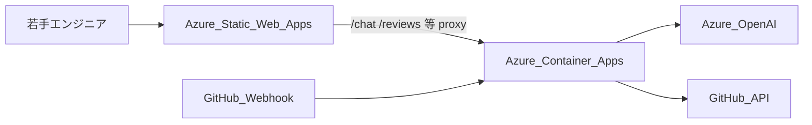
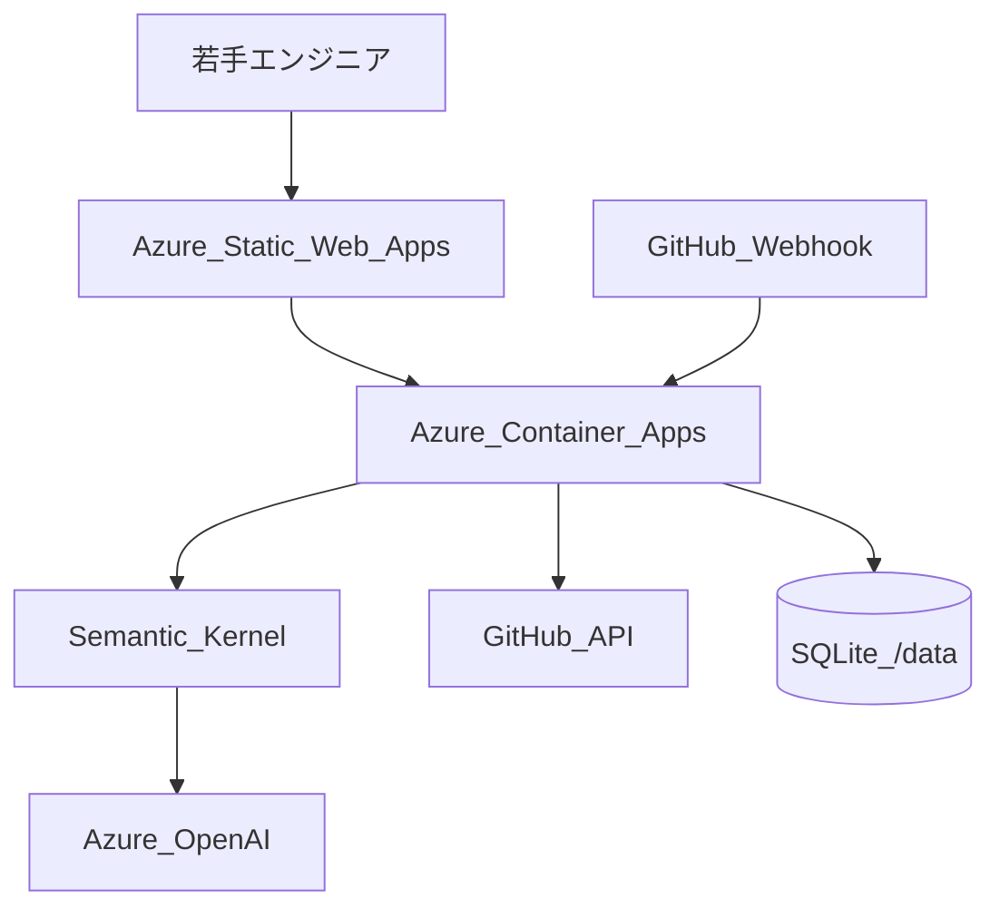

# Azure デプロイ手順 — Microsoft Agent Hackathon 2026 提出用

Norn は **フロントエンド: Azure Static Web Apps** + **バックエンド: Azure Container Apps** の分割構成を推奨します（SSE・Basic 認証を同一オリジン proxy で扱いやすいため）。

## アーキテクチャ



| コンポーネント | Azure サービス | ワークフロー job |
|---|---|---|
| フロント（React UI） | Static Web Apps | `Deploy to Azure` → **Frontend** |
| API / Webhook / SSE | Container Apps | `Deploy to Azure` → **Backend** |

---

## Step 1: フロントエンド（Static Web Apps）— まずここから

### 1-1. Azure CLI で SWA リソース作成

```bash
az login
chmod +x deploy/azure-swa-bootstrap.sh
./deploy/azure-swa-bootstrap.sh
```

> Static Web Apps は **Japan East 非対応** のため、スクリプトは `eastasia` をデフォルトにしています。Container Apps は `japaneast` のまま使えます。

表示された **デプロイトークン** を GitHub → Settings → Secrets → Actions に登録:

| Secret | 値 |
|---|---|
| `AZURE_STATIC_WEB_APPS_API_TOKEN` | bootstrap スクリプト出力 |

### 1-2. デプロイ実行

- **自動**: `main` に `frontend/` の変更を push
- **手動**: Actions → **Deploy to Azure** → Run workflow（Frontend / Backend を個別に ON/OFF 可能）

完了後 `https://<name>.azurestaticapps.net` で UI が表示されます（API 未接続のためチャットはエラー — 正常）。

### 1-3. バックエンド接続後（Step 2 完了後）

GitHub Secrets を追加して frontend ワークフローを再実行:

| Secret | 用途 |
|---|---|
| `NORN_API_BASE_URL` | 例: `https://norn.xxx.azurecontainerapps.io` — SWA が API を proxy |
| `NORN_CORS_ORIGINS` | 直接 API 接続時のみ（backend の env にも同値を設定） |

`NORN_API_BASE_URL` を設定すると `deploy/generate-swa-config.sh` が `/chat` `/reviews` 等をバックエンドへ reverse proxy します。**`VITE_API_BASE_URL` は通常不要**（同一オリジン proxy 利用時）。

Container Apps 側:

```bash
az containerapp update -g norn-hackathon-rg -n norn \
  --set-env-vars NORN_APP_BASE_URL='https://<swa-hostname>.azurestaticapps.net'
```

---

## Step 2: バックエンド（Container Apps）

## 前提

- [Azure CLI](https://learn.microsoft.com/cli/azure/install-azure-cli) がインストール済み
- [Docker](https://www.docker.com/) がインストール済み（ローカル CLI デプロイ時）
- Azure OpenAI / GitHub の認証情報を用意済み

## GitHub Actions でデプロイ（推奨）

`main` への push（`backend/` `frontend/` `deploy/` `Dockerfile` 変更時）または Actions タブから手動実行で、Azure Container Apps に自動デプロイします。

### 1. 初回のみ: Service Principal 作成

```bash
az login
SUBSCRIPTION_ID="$(az account show --query id -o tsv)"

az ad sp create-for-rbac \
  --name "github-norn-deploy" \
  --role contributor \
  --scopes "/subscriptions/${SUBSCRIPTION_ID}/resourceGroups/norn-hackathon-rg" \
  --sdk-auth
```

出力 JSON 全体を GitHub リポジトリの **Settings → Secrets → Actions** に `AZURE_CREDENTIALS` として登録します。

> リソースグループが未作成の場合は、先に `az group create --name norn-hackathon-rg --location japaneast` を実行するか、スコープを `/subscriptions/${SUBSCRIPTION_ID}` に広げてください。

### 2. GitHub Secrets（アプリ設定）

| Secret 名 | 必須 | 用途 |
|---|---|---|
| `AZURE_CREDENTIALS` | ✅ | 上記 Service Principal JSON |
| `AZURE_OPENAI_API_KEY` | ✅ | Azure OpenAI API キー |
| `AZURE_OPENAI_ENDPOINT` | ✅ | 例: `https://{resource}.services.ai.azure.com/openai/v1` |
| `AZURE_OPENAI_DEPLOYMENT` | — | デフォルト `gpt-4.1-mini` |
| `NORN_GITHUB_TOKEN` | ✅ | PyGithub 用 PAT（`repo` スコープ） |
| `GITHUB_WEBHOOK_SECRET` | ✅ | Webhook HMAC 検証 |
| `NORN_BASIC_AUTH_USERNAME` | — | Basic 認証（任意） |
| `NORN_BASIC_AUTH_PASSWORD` | — | Basic 認証（任意） |
| `NORN_CORS_ORIGINS` | — | SWA URL（直接 API 接続時。proxy 利用時は不要） |

> `NORN_GITHUB_TOKEN` は Actions 組み込みの `GITHUB_TOKEN` と別物です。アプリが GitHub API を呼ぶための PAT を設定してください。

### 3. デプロイ実行

- **自動**: `main` に push（変更パスに応じて Frontend / Backend の該当 job のみ実行）
- **手動**: Actions → **Deploy to Azure** → Run workflow

デプロイ後、ワークフローのログに `App URL: https://<fqdn>` が表示されます。

### 4. ACR 名の変更

デフォルト ACR 名 `nornhackathon` はグローバル一意である必要があります。衝突する場合は `.github/workflows/deploy.yml` の `ACR_NAME` を変更してください。

---

## クイックデプロイ（ローカル CLI）

```bash
# 1. ログイン
az login

# 2. Container Apps 拡張
az extension add --name containerapp --upgrade

# 3. デプロイ（ACR 名はグローバル一意・英小文字のみ）
export RESOURCE_GROUP=norn-hackathon-rg
export ACR_NAME=nornhackathon$(date +%s | tail -c 6)   # 例: 末尾5桁で衝突回避
chmod +x deploy/azure-deploy.sh
./deploy/azure-deploy.sh
```

スクリプト完了後に表示される `https://<fqdn>` が **提出用 URL** です。

## デプロイ後の必須設定

### 1. シークレット（Azure Portal または CLI）

| シークレット名 | 環境変数名 |
|---|---|
| `azure-openai-api-key` | `AZURE_OPENAI_API_KEY` |
| `github-token` | `GITHUB_TOKEN` |
| `github-webhook-secret` | `GITHUB_WEBHOOK_SECRET` |

```bash
az containerapp secret set \
  -g "$RESOURCE_GROUP" -n norn \
  --secrets \
    azure-openai-api-key='YOUR_KEY' \
    github-token='ghp_...' \
    github-webhook-secret='YOUR_SECRET'

az containerapp update \
  -g "$RESOURCE_GROUP" -n norn \
  --set-env-vars \
    AZURE_OPENAI_API_KEY=secretref:azure-openai-api-key \
    AZURE_OPENAI_ENDPOINT='https://YOUR-RESOURCE.openai.azure.com/' \
    AZURE_OPENAI_DEPLOYMENT='gpt-4.1-mini' \
    GITHUB_TOKEN=secretref:github-token \
    GITHUB_WEBHOOK_SECRET=secretref:github-webhook-secret \
    NORN_APP_BASE_URL='https://YOUR-FQDN' \
    LOG_LEVEL=INFO
```

### 2. GitHub Webhook

リポジトリ Settings → Webhooks → Add webhook:

| 項目 | 値 |
|---|---|
| Payload URL | `https://<fqdn>/webhook/github` |
| Content type | `application/json` |
| Secret | `GITHUB_WEBHOOK_SECRET` と同じ値 |
| Events | `Pull requests`, `Issue comments` |

### 3. 動作確認

```bash
curl https://<fqdn>/healthz
# {"status":"ok"}
```

Basic 認証を有効にしている場合:

```bash
# Container Apps の環境変数に追加
# NORN_BASIC_AUTH_USERNAME=norn
# NORN_BASIC_AUTH_PASSWORD=<secure-password>

curl -u norn:<secure-password> https://<fqdn>/chat/threads?user_level=junior
```

ブラウザで `https://<fqdn>/` を開き、Basic 認証ダイアログ後にチャット UI が表示されることを確認。

## ローカル Docker 確認（デプロイ前）

```bash
# フロントビルド込みでイメージ作成
docker build -t norn:local .

# 起動（backend/.env をマウント）
docker run --rm -p 8000:8000 --env-file backend/.env \
  -e NORN_APP_BASE_URL=http://localhost:8000 \
  -v norn-data:/data \
  norn:local
```

http://localhost:8000 で UI + API が同一オリジンで動作します。

## アーキテクチャ（提出記事用）



- **フロント**: Azure Static Web Apps（React SPA）
- **API / Webhook**: Azure Container Apps（Consumption）
- **AI**: Azure OpenAI + Semantic Kernel コネクタ
- **永続化**: コンテナ内 SQLite（`/data` ボリューム推奨）
- **SSE**: シングルレプリカ（`--workers 1`）必須。SWA proxy 経由で同一オリジン接続

## データ永続化（任意）

Container Apps で Azure Files をマウントすると、再起動後も DB が残ります。

```bash
# ストレージ作成例（詳細は Azure ドキュメント参照）
az containerapp update \
  -g "$RESOURCE_GROUP" -n norn \
  --set-env-vars DATABASE_URL=sqlite+aiosqlite:////data/norn.db
```

## トラブルシューティング

| 症状 | 対処 |
|---|---|
| 502 / 起動失敗 | `az containerapp logs show -g RG -n norn --follow` でログ確認 |
| SSE が届かない | レプリカが 2 以上になっていないか確認（max-replicas=1） |
| Webhook 403 | `GITHUB_WEBHOOK_SECRET` の一致を確認 |
| 合議が失敗 | Azure OpenAI の endpoint / deployment 名を確認 |
| PR コメントリンクが localhost | `NORN_APP_BASE_URL` を公開 URL に更新 |

## 提出時に記載する URL

- **成果物 URL（UI）**: `https://<swa-hostname>.azurestaticapps.net/`
- **API / ヘルスチェック**: `https://<container-app-fqdn>/healthz`
- **Webhook エンドポイント**: `https://<container-app-fqdn>/webhook/github`
