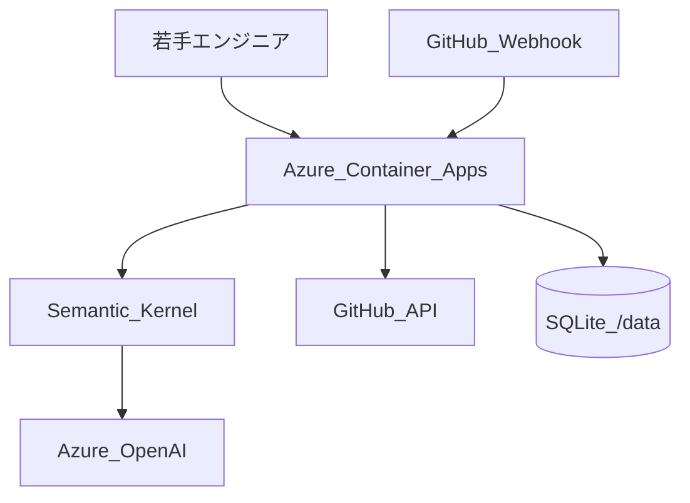

# Azure デプロイ手順 — Microsoft Agent Hackathon 2026 提出用

Norn を **Azure Container Apps** に 1 コンテナでデプロイし、ハッカソン提出用の公開 URL を確保する手順です。

## 前提

- [Azure CLI](https://learn.microsoft.com/cli/azure/install-azure-cli) がインストール済み
- [Docker](https://www.docker.com/) がインストール済み
- Azure OpenAI / GitHub の認証情報を用意済み

## クイックデプロイ

```bash
# 1. ログイン
az login

# 2. Container Apps 拡張
az extension add --name containerapp --upgrade

# 3. デプロイ（ACR 名はグローバル一意・英小文字のみ）
export RESOURCE_GROUP=norn-hackathon-rg
export ACR_NAME=nornhackathon$(date +%s | tail -c 6)   # 例: 末尾5桁で衝突回避
chmod +x deploy/azure-deploy.sh
./deploy/azure-deploy.sh
```

スクリプト完了後に表示される `https://<fqdn>` が **提出用 URL** です。

## デプロイ後の必須設定

### 1. シークレット（Azure Portal または CLI）

| シークレット名 | 環境変数名 |
|---|---|
| `azure-openai-api-key` | `AZURE_OPENAI_API_KEY` |
| `github-token` | `GITHUB_TOKEN` |
| `github-webhook-secret` | `GITHUB_WEBHOOK_SECRET` |

```bash
az containerapp secret set \
  -g "$RESOURCE_GROUP" -n norn \
  --secrets \
    azure-openai-api-key='YOUR_KEY' \
    github-token='ghp_...' \
    github-webhook-secret='YOUR_SECRET'

az containerapp update \
  -g "$RESOURCE_GROUP" -n norn \
  --set-env-vars \
    AZURE_OPENAI_API_KEY=secretref:azure-openai-api-key \
    AZURE_OPENAI_ENDPOINT='https://YOUR-RESOURCE.openai.azure.com/' \
    AZURE_OPENAI_DEPLOYMENT='gpt-4.1-mini' \
    GITHUB_TOKEN=secretref:github-token \
    GITHUB_WEBHOOK_SECRET=secretref:github-webhook-secret \
    NORN_APP_BASE_URL='https://YOUR-FQDN' \
    LOG_LEVEL=INFO
```

### 2. GitHub Webhook

リポジトリ Settings → Webhooks → Add webhook:

| 項目 | 値 |
|---|---|
| Payload URL | `https://<fqdn>/webhook/github` |
| Content type | `application/json` |
| Secret | `GITHUB_WEBHOOK_SECRET` と同じ値 |
| Events | `Pull requests`, `Issue comments` |

### 3. 動作確認

```bash
curl https://<fqdn>/healthz
# {"status":"ok"}
```

ブラウザで `https://<fqdn>/` を開き、チャット UI が表示されることを確認。

## ローカル Docker 確認（デプロイ前）

```bash
# フロントビルド込みでイメージ作成
docker build -t norn:local .

# 起動（backend/.env をマウント）
docker run --rm -p 8000:8000 --env-file backend/.env \
  -e NORN_APP_BASE_URL=http://localhost:8000 \
  -v norn-data:/data \
  norn:local
```

http://localhost:8000 で UI + API が同一オリジンで動作します。

## アーキテクチャ（提出記事用）



- **実行基盤**: Azure Container Apps（Consumption）
- **AI**: Azure OpenAI + Semantic Kernel コネクタ
- **永続化**: コンテナ内 SQLite（`/data` ボリューム推奨）
- **SSE**: シングルレプリカ（`--workers 1`）必須

## データ永続化（任意）

Container Apps で Azure Files をマウントすると、再起動後も DB が残ります。

```bash
# ストレージ作成例（詳細は Azure ドキュメント参照）
az containerapp update \
  -g "$RESOURCE_GROUP" -n norn \
  --set-env-vars DATABASE_URL=sqlite+aiosqlite:////data/norn.db
```

## トラブルシューティング

| 症状 | 対処 |
|---|---|
| 502 / 起動失敗 | `az containerapp logs show -g RG -n norn --follow` でログ確認 |
| SSE が届かない | レプリカが 2 以上になっていないか確認（max-replicas=1） |
| Webhook 403 | `GITHUB_WEBHOOK_SECRET` の一致を確認 |
| 合議が失敗 | Azure OpenAI の endpoint / deployment 名を確認 |
| PR コメントリンクが localhost | `NORN_APP_BASE_URL` を公開 URL に更新 |

## 提出時に記載する URL

- **成果物 URL**: `https://<container-app-fqdn>/`
- **ヘルスチェック**: `https://<fqdn>/healthz`
- **Webhook エンドポイント**: `https://<fqdn>/webhook/github`（記事の参考情報として）
